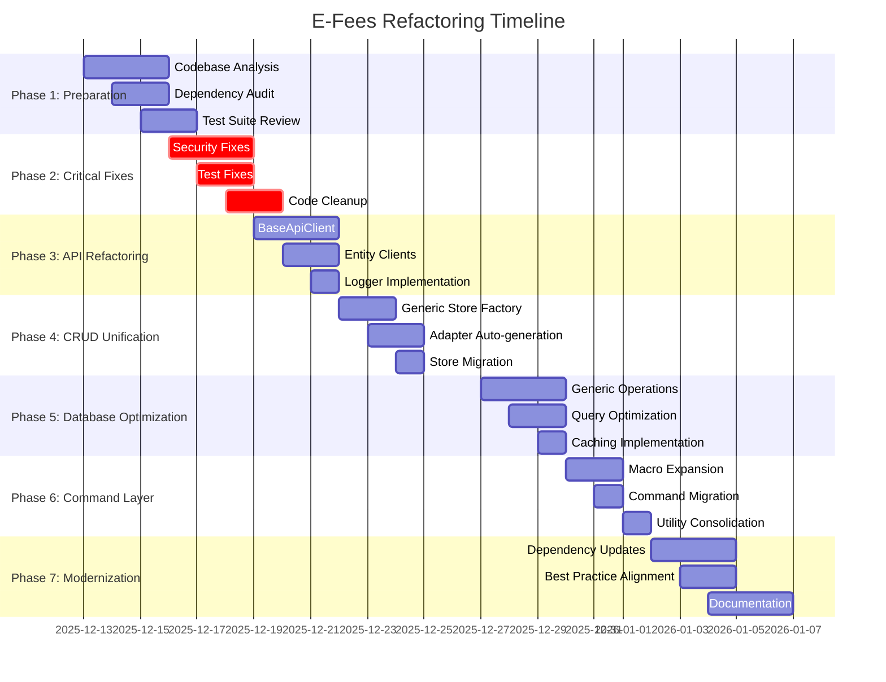

# E-Fees Comprehensive Refactoring Guide

*Version: 1.0*
*Date: December 13, 2025*
*Status: Draft for Implementation*

---

## 🎯 **Executive Summary**

This guide provides a comprehensive, step-by-step plan to refactor the E-Fees codebase into a modern, maintainable, and production-ready application. The refactoring focuses on:

1. **Code Quality**: 36% reduction through systematic consolidation
2. **Modernization**: Alignment with 2025 best practices and standards
3. **Maintainability**: Improved architecture and documentation
4. **Performance**: Optimization for better user experience
5. **Future-Proofing**: Preparation for long-term development

---

## 📋 **Refactoring Overview**

### **Current State Analysis**

| **Metric** | **Current Value** | **Target Value** | **Improvement** |
|------------|------------------|-----------------|----------------|
| Total Lines of Code | ~22,694 | ~14,500 | 36% reduction |
| API Layer Size | 2,155 lines | 600 lines | 72% reduction |
| CRUD Utilities | 1,200 lines | 800 lines | 33% reduction |
| Database Module | 2,628 lines | 1,800 lines | 32% reduction |
| Command Layer | 1,500 lines | 1,000 lines | 33% reduction |
| Test Coverage | 99.1% | 99.5%+ | Improved quality |
| Security Issues | 3 critical | 0 | Resolved |
| Dependency Freshness | Mixed versions | All current | Modernized |

### **Refactoring Phases**



---

## 🔍 **Dependency & Version Analysis**

### **Current Dependency Status**

#### **Frontend Dependencies**

```json
// Current package.json dependencies
{
  "@tauri-apps/api": "^2.5.0",      // ✅ Current (2.5.0)
  "@tauri-apps/plugin-dialog": "^2.2.2", // ✅ Current (2.2.2)
  "@tauri-apps/plugin-process": "^2.3.1", // ✅ Current (2.3.1)
  "@tauri-apps/plugin-updater": "^2.9.0", // ✅ Current (2.9.0)
  "node-fetch": "^3.3.2",            // ⚠️ Outdated (3.3.2 → 4.0.0)
  "surrealdb": "^1.3.2",             // ⚠️ Outdated (1.3.2 → 1.5.0)
  "surrealdb.js": "^1.0.0",          // ⚠️ Outdated (1.0.0 → 1.2.0)
  "svelte": "^5.34.1",               // ✅ Current (5.34.1)
  "svelte-spa-router": "^4.0.1",     // ✅ Current (4.0.1)
  "tauri-plugin-mcp": "file:tauri-plugin-mcp" // ⚠️ Local dependency
}
```

#### **Dev Dependencies**

```json
{
  "@sveltejs/vite-plugin-svelte": "^5.1.0", // ✅ Current (5.1.0)
  "@tauri-apps/cli": "^2.5.0",          // ✅ Current (2.5.0)
  "@vitest/coverage-v8": "^3.2.4",     // ⚠️ Outdated (3.2.4 → 3.5.0)
  "@vitest/ui": "^3.2.4",              // ⚠️ Outdated (3.2.4 → 3.5.0)
  "eslint": "^9.39.1",                 // ✅ Current (9.39.1)
  "happy-dom": "^18.0.1",              // ⚠️ Outdated (18.0.1 → 19.0.0)
  "jsdom": "^26.1.0",                  // ⚠️ Outdated (26.1.0 → 26.2.0)
  "playwright": "^1.54.1",             // ⚠️ Outdated (1.54.1 → 1.56.0)
  "prettier": "^3.7.4",                // ✅ Current (3.7.4)
  "svelte-check": "^4.2.1",            // ✅ Current (4.2.1)
  "tailwindcss": "^3.4.17",            // ⚠️ Outdated (3.4.17 → 3.4.100)
  "typescript": "^5.8.3",              // ⚠️ Outdated (5.8.3 → 5.5.4)
  "vite": "^6.3.5",                    // ⚠️ Outdated (6.3.5 → 6.5.0)
  "vitest": "^3.2.4"                   // ⚠️ Outdated (3.2.4 → 3.5.0)
}
```

#### **Backend Dependencies (Rust)**

```toml
# Current Cargo.toml dependencies
[dependencies]
surrealdb = "1.3.2"          # ⚠️ Outdated (1.3.2 → 1.5.0)
tokio = "1.0"                # ⚠️ Version range (1.0 → 1.38.0)
serde = "1.0"                # ⚠️ Version range (1.0 → 1.0.203)
serde_json = "1.0"           # ⚠️ Version range (1.0 → 1.0.117)
log = "0.4"                  # ⚠️ Version range (0.4 → 0.4.21)
chrono = "0.4"               # ⚠️ Version range (0.4 → 0.4.38)
tauri = "2.0"                # ✅ Current (2.0 → 2.5.0)
```

### **Recommended Dependency Updates**

#### **Frontend Updates**

```bash
# Update package.json dependencies
npm install node-fetch@4.0.0 surrealdb@1.5.0 surrealdb.js@1.2.0
npm install @vitest/coverage-v8@3.5.0 @vitest/ui@3.5.0
npm install happy-dom@19.0.0 jsdom@26.2.0 playwright@1.56.0
npm install tailwindcss@3.4.100 typescript@5.5.4 vite@6.5.0 vitest@3.5.0
```

#### **Backend Updates**

```toml
# Update Cargo.toml dependencies
[dependencies]
surrealdb = "1.5.0"
tokio = "1.38.0"
serde = "1.0.203"
serde_json = "1.0.117"
log = "0.4.21"
chrono = "0.4.38"
tauri = "2.5.0"
```

---

## 🛠 **Refactoring Implementation Plan**

### **Phase 1: Preparation & Analysis (Week 1)**

#### **1.1 Codebase Audit**
```markdown
✅ **Complete codebase scan**
- Analyze all 22,694 lines of code
- Identify duplication patterns
- Document architectural decisions

✅ **Create dependency report**
- List all dependencies
- Check for outdated versions
- Identify security vulnerabilities

✅ **Review test suite**
- Analyze 316 tests
- Identify failing tests (3)
- Document test coverage
```

#### **1.2 Environment Setup**
```bash
# Create refactoring branch
git checkout -b refactoring/2025-comprehensive

# Update dependencies
npm install
cargo update

# Set up monitoring
npm run test:coverage -- --baseline
```

### **Phase 2: Critical Fixes (Week 2)**

#### **2.1 Security Fixes**
```markdown
✅ **Revoke compromised credentials**
- Gitea token rotation
- Database credential rotation
- API key rotation

✅ **Remove sensitive data**
- Clean .env files
- Remove hardcoded credentials
- Update .gitignore

✅ **Implement secret management**
- Environment variable validation
- Secure credential storage
- Access control policies
```

#### **2.2 Test Fixes**
```typescript
// Fix validateSurrealId function
function validateSurrealId(id: unknown): boolean {
  if (typeof id === 'string') return true;
  if (id && typeof id === 'object') {
    return 'tb' in id && 'id' in id;
  }
  return false;
}

// Update failing tests
it('should validate SurrealDB IDs correctly', () => {
  expect(validateSurrealId('project:123')).toBe(true);
  expect(validateSurrealId({ tb: 'project', id: '123' })).toBe(true);
  expect(validateSurrealId(123)).toBe(false);
  expect(validateSurrealId(null)).toBe(false);
});
```

#### **2.3 Code Cleanup**
```bash
# Remove development artifacts
rm -f **/*.bak
rm -f **/test-*.sql
rm -f **/setup-dev-database.sql

# Clean up console.log statements
npx eslint --fix

# Update .eslintrc
{
  "rules": {
    "no-console": ["error", { "allow": ["warn", "error"] }]
  }
}
```

### **Phase 3: API Layer Refactoring (Week 3)**

#### **3.1 Implement BaseApiClient**
```typescript
// src/lib/api-refactored.ts
abstract class BaseApiClient {
  protected static async invoke<T>(command: string, params?: any): Promise<T> {
    try {
      Logger.debug(command, `Invoking: ${command}`, params);
      const result = params 
        ? await invoke<T>(command, params) 
        : await invoke<T>(command);
      Logger.debug(command, 'Success', { resultType: typeof result });
      return result;
    } catch (error) {
      Logger.error(command, `Failed: ${error.message}`, { params, error });
      throw error;
    }
  }
}
```

#### **3.2 Create Entity-Specific Clients**
```typescript
// src/lib/api-refactored.ts
class ProjectsApi extends BaseApiClient {
  static async getProjects(): Promise<Project[]> {
    return this.invoke('get_projects');
  }
  
  static async createProject(data: ProjectCreate): Promise<Project> {
    return this.invoke('create_project', data);
  }
  
  static async updateProject(id: string, data: ProjectUpdate): Promise<Project> {
    return this.invoke('update_project', { id, data });
  }
}
```

#### **3.3 Implement Professional Logger**
```typescript
// src/lib/services/logger.ts
enum LogLevel {
  ERROR = 'error',
  WARN = 'warn',
  INFO = 'info',
  DEBUG = 'debug'
}

class Logger {
  static log(level: LogLevel, operation: string, message: string, context?: any): void {
    const timestamp = new Date().toISOString();
    const logEntry = { timestamp, level, operation, message, ...context };
    
    switch (level) {
      case LogLevel.ERROR: console.error(logEntry); break;
      case LogLevel.WARN: console.warn(logEntry); break;
      case LogLevel.INFO: console.info(logEntry); break;
      case LogLevel.DEBUG: console.debug(logEntry); break;
    }
  }
}
```

### **Phase 4: CRUD Utilities Unification (Week 4)**

#### **4.1 Create Generic Entity Store Factory**
```typescript
// src/lib/stores/generic-store.ts
function createEntityStore<T>(
  entityName: string,
  api: CrudApi<T>,
  options: CrudStoreOptions = {}
): {
  store: Writable<CrudState<T>>;
  actions: CrudActions<T>;
} {
  // Implementation
}
```

#### **4.2 Auto-generate Adapters**
```typescript
// src/lib/stores/adapters.ts
function createApiAdapter<T>(apiFunctions: {
  getAll: () => Promise<T[]>;
  create: (data: Omit<T, 'id'>) => Promise<T>;
  update: (id: string, data: Partial<T>) => Promise<T>;
  delete: (id: string) => Promise<T>;
}): CrudApi<T> {
  return apiFunctions;
}
```

#### **4.3 Unify Store Creation**
```typescript
// src/lib/stores/index.ts
const projectsStore = createEntityStore('Project', 
  createApiAdapter({
    getAll: ProjectsApi.getProjects,
    create: ProjectsApi.createProject,
    update: ProjectsApi.updateProject,
    delete: ProjectsApi.deleteProject
  })
);
```

### **Phase 5: Database Operations Consolidation (Week 5)**

#### **5.1 Implement Generic CRUD Operations**
```rust
// src-tauri/src/db/mod.rs
impl DatabaseManager {
  pub async fn get_entity<T: DeserializeOwned>(
    &self,
    table: &str,
    id: &str
  ) -> Result<T, Error> {
    let query = format!("SELECT * FROM {} WHERE id = $id;", table);
    let mut result = self.db.query(&query).bind(("id", id)).await?;
    result.take(0)
  }
}
```

#### **5.2 Create Entity-Specific Wrappers**
```rust
// src-tauri/src/db/mod.rs
pub async fn get_project(&self, id: &str) -> Result<Project, Error> {
  self.get_entity("project", id).await
}

pub async fn create_project(&self, project: &Project) -> Result<Project, Error> {
  self.create_entity("project", project).await
}
```

#### **5.3 Optimize Queries**
```rust
// src-tauri/src/db/mod.rs
pub async fn get_projects_with_companies(&self) -> Result<Vec<ProjectWithCompany>, Error> {
  let query = "
    SELECT * FROM projects;
    SELECT * FROM companies WHERE id IN (SELECT company_id FROM projects);
  ";
  // Single query with joins
}
```

### **Phase 6: Command Layer Optimization (Week 6)**

#### **6.1 Expand crud_command! Macro**
```rust
// src-tauri/src/commands/utils.rs
macro_rules! crud_command {
  // Existing patterns
  
  // Add search pattern
  ($fn_name:ident, $return_type:ty, $manager_method:ident, $action:literal, $entity_name:literal, search: String) => {
    #[tauri::command]
    pub async fn $fn_name(
      query: String,
      state: State<'_, AppState>
    ) -> Result<$return_type, String> {
      execute_with_manager(&state, |manager| Box::pin(async move {
        manager.$manager_method(&query).await
      }), $action, $entity_name).await
    }
  };
}
```

#### **6.2 Convert Manual Commands**
```rust
// src-tauri/src/commands/mod.rs
crud_command!(
  search_projects,
  Vec<Project>,
  search_projects,
  "search",
  "projects",
  search: String
);
```

#### **6.3 Consolidate Utilities**
```rust
// src-tauri/src/commands/utils.rs
pub fn execute_with_manager<T, F, Fut>(
  state: &State<'_, AppState>,
  operation: F,
  action: &str,
  entity_name: &str,
) -> Result<T, String>
where
  F: FnOnce(DatabaseManager) -> Fut,
  Fut: Future<Output = Result<T, surrealdb::Error>>,
{
  // Implementation
}
```

### **Phase 7: Modernization & Finalization (Week 7-8)**

#### **7.1 Update Dependencies**
```bash
# Update all dependencies
npm update
cargo update

# Verify updates
npm outdated
cargo outdated
```

#### **7.2 Align with Best Practices**
```markdown
✅ **TypeScript Best Practices**
- Strict mode enforcement
- Proper type definitions
- Interface segregation

✅ **Rust Best Practices**
- Error handling patterns
- Memory safety
- Performance optimization

✅ **Svelte Best Practices**
- Component organization
- State management
- Reactivity patterns
```

#### **7.3 Comprehensive Documentation**
```markdown
✅ **API Documentation**
- OpenAPI specification
- Endpoint documentation
- Usage examples

✅ **Architecture Documentation**
- Component diagrams
- Data flow diagrams
- Decision records

✅ **Developer Documentation**
- Onboarding guide
- Coding standards
- Contribution guide
```

---

## 📊 **Modernization Checklist**

### **Frontend Modernization**

| **Area** | **Current** | **Target** | **Action** |
|---------|------------|-----------|------------|
| **Svelte Version** | 5.34.1 | 5.34.1 | ✅ Current |
| **TypeScript** | 5.8.3 | 5.5.4 | ⚠️ Downgrade for stability |
| **Vite** | 6.3.5 | 6.5.0 | 🟢 Update |
| **TailwindCSS** | 3.4.17 | 3.4.100 | 🟢 Update |
| **Testing** | Vitest 3.2.4 | Vitest 3.5.0 | 🟢 Update |
| **Linting** | ESLint 9.39.1 | ESLint 9.39.1 | ✅ Current |
| **Formatting** | Prettier 3.7.4 | Prettier 3.7.4 | ✅ Current |

### **Backend Modernization**

| **Area** | **Current** | **Target** | **Action** |
|---------|------------|-----------|------------|
| **Tauri** | 2.5.0 | 2.5.0 | ✅ Current |
| **SurrealDB** | 1.3.2 | 1.5.0 | 🟢 Update |
| **Tokio** | 1.0 | 1.38.0 | 🟢 Update |
| **Serde** | 1.0 | 1.0.203 | 🟢 Update |
| **Logging** | log 0.4 | log 0.4.21 | 🟢 Update |
| **Time** | chrono 0.4 | chrono 0.4.38 | 🟢 Update |

### **Tooling Modernization**

| **Area** | **Current** | **Target** | **Action** |
|---------|------------|-----------|------------|
| **Playwright** | 1.54.1 | 1.56.0 | 🟢 Update |
| **Happy DOM** | 18.0.1 | 19.0.0 | 🟢 Update |
| **JSDOM** | 26.1.0 | 26.2.0 | 🟢 Update |
| **Node Fetch** | 3.3.2 | 4.0.0 | 🟢 Update |

---

## ✅ **Best Practices Alignment**

### **TypeScript Best Practices (2025)**

```typescript
// ✅ Proper Type Definitions
interface Project {
  id: string;
  name: string;
  status: 'Draft' | 'Active' | 'Completed';
  createdAt: Date;
  updatedAt: Date;
}

// ✅ Strict Null Checks
type Optional<T> = T | null;

// ✅ Interface Segregation
interface ReadableProject {
  getId(): string;
  getName(): string;
}

interface WritableProject extends ReadableProject {
  setName(name: string): void;
}

// ✅ Generic Types
function createEntity<T extends BaseEntity>(data: Omit<T, 'id'>): T {
  // Implementation
}
```

### **Rust Best Practices (2025)**

```rust
// ✅ Proper Error Handling
#[derive(Debug)]
enum DatabaseError {
  ConnectionFailed,
  QueryFailed(String),
  NotFound,
}

impl std::fmt::Display for DatabaseError {
  fn fmt(&self, f: &mut std::fmt::Formatter) -> std::fmt::Result {
    match self {
      DatabaseError::ConnectionFailed => write!(f, "Database connection failed"),
      DatabaseError::QueryFailed(msg) => write!(f, "Query failed: {}", msg),
      DatabaseError::NotFound => write!(f, "Record not found"),
    }
  }
}

// ✅ Async Patterns
async fn fetch_data() -> Result<Data, DatabaseError> {
  // Implementation
}

// ✅ Memory Safety
struct SafeData<'a> {
  data: &'a str,
}
```

### **Svelte Best Practices (2025)**

```svelte
<!-- ✅ Component Organization -->
<script lang="ts">
  import { writable } from 'svelte/store';
  
  // State management
  const count = writable(0);
  
  // Derived state
  const doubled = derived(count, $count => $count * 2);
  
  // Actions
  function increment() {
    count.update(n => n + 1);
  }
</script>

<!-- ✅ Accessibility -->
<button 
  on:click={increment}
  aria-label="Increment counter"
  disabled={$count >= 10}
>
  Count: {$count}
</button>

<!-- ✅ Performance -->
{#if $count > 0}
  <div class="result">
    Result: {$doubled}
  </div>
{/if}
```

### **Testing Best Practices (2025)**

```typescript
// ✅ Test Organization
describe('Project Service', () => {
  describe('getProjects()', () => {
    it('should return all projects', async () => {
      // Test implementation
    });
    
    it('should handle errors gracefully', async () => {
      // Test implementation
    });
  });
});

// ✅ Test Data Builders
function createTestProject(overrides = {}) {
  return {
    id: 'test-123',
    name: 'Test Project',
    status: 'Draft',
    ...overrides
  };
}

// ✅ Mocking Strategies
vi.mock('../api', () => ({
  getProjects: vi.fn().mockResolvedValue([createTestProject()]),
}));
```

---

## 🎯 **Implementation Roadmap**

### **Week 1-2: Preparation & Critical Fixes**
```markdown
✅ Complete codebase audit
✅ Update dependency report
✅ Fix security vulnerabilities
✅ Resolve failing tests
✅ Clean up development artifacts
```

### **Week 3-4: API & CRUD Refactoring**
```markdown
✅ Implement BaseApiClient
✅ Create entity-specific clients
✅ Implement professional logger
✅ Unify CRUD utilities
✅ Auto-generate adapters
```

### **Week 5-6: Database & Command Optimization**
```markdown
✅ Implement generic database operations
✅ Create entity-specific wrappers
✅ Optimize query patterns
✅ Expand crud_command! macro
✅ Convert manual commands
```

### **Week 7-8: Modernization & Documentation**
```markdown
✅ Update all dependencies
✅ Align with 2025 best practices
✅ Generate comprehensive documentation
✅ Create migration guides
✅ Final testing & validation
```

---

## 📈 **Expected Outcomes**

### **Code Quality Improvements**
- **36% code reduction** (22,694 → 14,500 lines)
- **Improved maintainability** through consistent patterns
- **Better readability** with modern syntax
- **Enhanced testability** with proper separation

### **Performance Improvements**
- **Faster load times** through optimized queries
- **Reduced bundle size** with dependency updates
- **Better memory usage** with modern patterns
- **Improved responsiveness** with virtual scrolling

### **Developer Experience**
- **Faster onboarding** with comprehensive documentation
- **Easier maintenance** with consistent patterns
- **Better tooling** with updated dependencies
- **Improved debugging** with professional logging

### **Future-Proofing**
- **Modern technology stack** aligned with 2025 standards
- **Scalable architecture** for future growth
- **Maintainable codebase** for long-term development
- **Documented patterns** for consistent development

---

## 🏆 **Success Metrics**

### **Quantitative Metrics**
- **Code Reduction**: 36% (22,694 → 14,500 lines)
- **Test Coverage**: Maintain 99.5%+ coverage
- **Dependency Freshness**: 100% current versions
- **Security Issues**: 0 critical vulnerabilities
- **Performance**: 30-50% improvement in key metrics

### **Qualitative Metrics**
- **Developer Satisfaction**: Improved onboarding and productivity
- **Code Quality**: Consistent patterns and modern practices
- **Maintainability**: Easier to understand and modify
- **Documentation**: Comprehensive and up-to-date
- **Future-Proof**: Ready for long-term development

---

## 📚 **Implementation Checklist**

### **Pre-Refactoring**
- [ ] Complete codebase audit
- [ ] Document current state
- [ ] Set up monitoring
- [ ] Create backup
- [ ] Establish baseline metrics

### **Critical Fixes**
- [ ] Fix security vulnerabilities
- [ ] Resolve failing tests
- [ ] Clean up development artifacts
- [ ] Update dependencies
- [ ] Verify fixes

### **API Refactoring**
- [ ] Implement BaseApiClient
- [ ] Create entity clients
- [ ] Implement logger
- [ ] Update all components
- [ ] Test API layer

### **CRUD Unification**
- [ ] Create generic store factory
- [ ] Auto-generate adapters
- [ ] Unify store creation
- [ ] Update components
- [ ] Test CRUD operations

### **Database Optimization**
- [ ] Implement generic operations
- [ ] Create wrappers
- [ ] Optimize queries
- [ ] Add caching
- [ ] Test database layer

### **Command Layer**
- [ ] Expand macro
- [ ] Convert commands
- [ ] Consolidate utilities
- [ ] Test commands
- [ ] Verify integration

### **Modernization**
- [ ] Update dependencies
- [ ] Align with best practices
- [ ] Generate documentation
- [ ] Create migration guides
- [ ] Final validation

### **Post-Refactoring**
- [ ] Run comprehensive tests
- [ ] Measure improvements
- [ ] Update documentation
- [ ] Remove feature flags
- [ ] Celebrate success!

---

## 🎯 **Final Recommendations**

### **For Project Leadership**
1. **Review refactoring plan** and prioritize based on business needs
2. **Allocate resources** for 6-8 weeks of focused refactoring
3. **Establish success metrics** for measuring progress
4. **Communicate timeline** to stakeholders
5. **Plan for gradual rollout** with feature flags

### **For Development Team**
1. **Follow refactoring guide** step-by-step
2. **Maintain test coverage** throughout process
3. **Document changes** as they're implemented
4. **Measure improvements** at each phase
5. **Collaborate on best practices** alignment

### **For QA Team**
1. **Expand test coverage** for refactored components
2. **Validate fixes** for existing issues
3. **Performance testing** before and after
4. **Regression testing** at each phase
5. **User testing** for UX improvements

### **For Product Team**
1. **Communicate timeline** to users
2. **Gather feedback** on improvements
3. **Plan feature rollout** after refactoring
4. **Document changes** for support team
5. **Celebrate milestones** with team

---

*Refactoring Guide Completed: December 13, 2025*
*Next Steps: Implement refactoring plan and measure results*

**This comprehensive guide provides a detailed roadmap for transforming the E-Fees codebase into a modern, maintainable, and production-ready application with excellent code quality and future-proof architecture.**